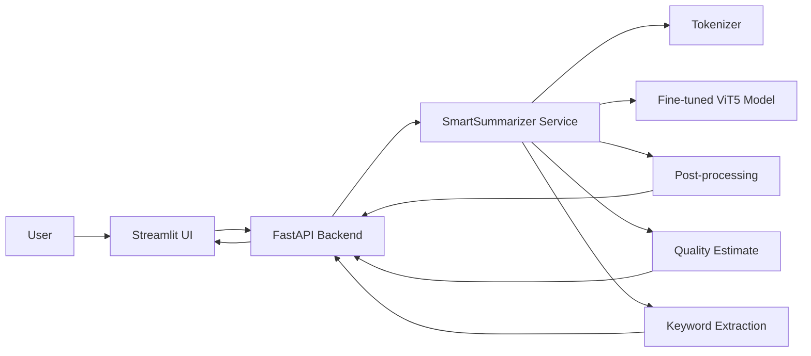
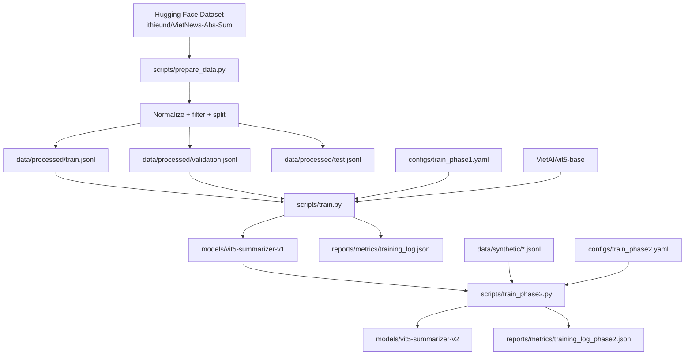
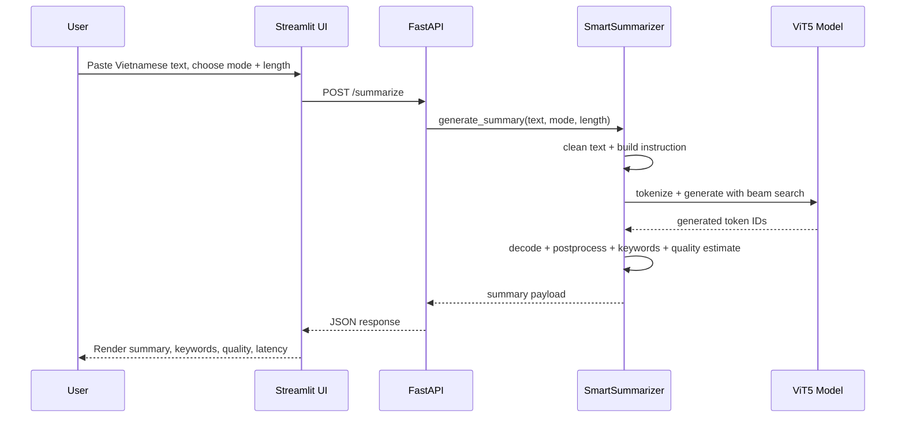
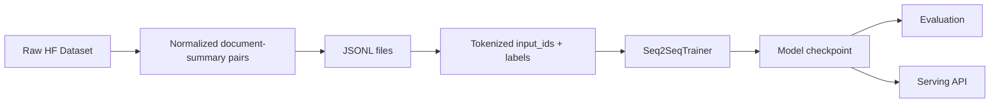
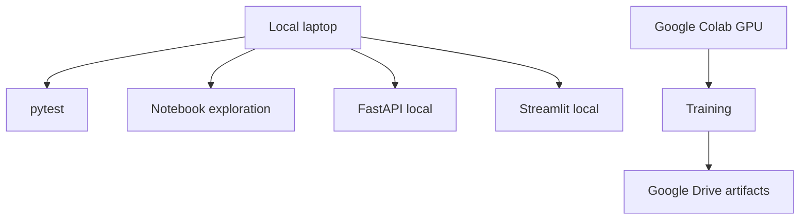
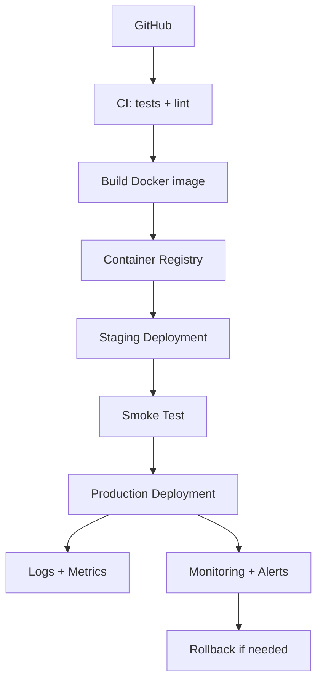

# Architecture Guide: Vietnamese Controllable Summarizer

Tài liệu này là bản đồ kỹ thuật của project. Mục tiêu là giúp bạn nhìn rõ hệ thống đang có những phần nào, dữ liệu đi qua đâu, model được train và deploy ra sao, và nếu làm production thật thì cần thêm những lớp nào.

Project hiện tại là một hệ thống **Vietnamese controllable abstractive summarization**:

```text
Long Vietnamese text + mode + length
        -> ViT5 summarization pipeline
        -> summary + keywords + quality estimate + latency
```

---

## 1. Big Picture



**Ý nghĩa từng lớp:**

| Layer | File / Folder | Vai trò |
|---|---|---|
| UI | `app/streamlit_app.py` | Giao diện để nhập text, chọn mode, chọn length, xem output |
| API | `api/main.py` | REST API nhận request từ UI hoặc client khác: health, summarize, compare modes |
| Product service | `src/smart_summarizer/product/summarizer.py` | Điều phối model, generation, keyword, quality |
| Model loading | `src/smart_summarizer/modeling/model_loader.py` | Load tokenizer/model và chọn device |
| Generation | `src/smart_summarizer/modeling/generation.py` | Build instruction, set beam search, length control |
| Post-processing | `src/smart_summarizer/product/postprocess.py` | Làm sạch output theo mode |
| Evaluation | `src/smart_summarizer/evaluation/` | ROUGE và error tags |
| CLI scripts | `scripts/` | Entry points cho data prep, training, eval, predict |
| Config | `configs/` | Tách tham số khỏi code |
| Artifacts | `models/`, `reports/`, `data/processed/` | Checkpoint, metrics, predictions, processed dataset |

---

## 2. Offline Training Architecture

Offline pipeline là phần chạy trước khi có model tốt để phục vụ user.



### Phase 1

Phase 1 dạy model kỹ năng tóm tắt tiếng Việt nói chung.

```text
Base model: VietAI/vit5-base
Dataset: ithieund/VietNews-Abs-Sum
Output: models/vit5-summarizer-v1
```

File chính:

```text
configs/train_phase1.yaml
scripts/prepare_data.py
scripts/train.py
```

### Phase 2

Phase 2 dạy model hiểu nhiều output mode hơn.

```text
Base model: models/vit5-summarizer-v1
Dataset: data/synthetic/train.jsonl + validation.jsonl
Output: models/vit5-summarizer-v2
```

Các mode:

```text
concise
bullet
action_items
study_notes
```

File chính:

```text
configs/train_phase2.yaml
scripts/generate_synthetic.py
scripts/train_phase2.py
```

---

## 3. Online Inference Architecture

Online pipeline là phần chạy mỗi khi user gửi text vào app.



Input API shape:

```json
{
  "text": "Nội dung tiếng Việt dài...",
  "mode": "bullet",
  "length": "medium"
}
```

Compare modes API shape:

```json
{
  "text": "Nội dung tiếng Việt dài...",
  "length": "medium"
}
```

Output API shape:

```json
{
  "summary": "...",
  "keywords": ["..."],
  "quality_estimate": 87.5,
  "latency_ms": 1200,
  "input_tokens": 312,
  "mode": "bullet",
  "length": "medium"
}
```

Compare modes response wraps one `SummarizeResponse` per mode:

```json
{
  "results": {
    "concise": {"summary": "...", "mode": "concise"},
    "bullet": {"summary": "...", "mode": "bullet"},
    "action_items": {"summary": "...", "mode": "action_items"},
    "study_notes": {"summary": "...", "mode": "study_notes"}
  }
}
```

---

## 4. Data Flow



Data format sau preprocessing:

```json
{
  "document": "Văn bản đầu vào...",
  "summary": "Bản tóm tắt tham chiếu..."
}
```

Synthetic format cho Phase 2:

```json
{
  "base_id": "meeting_01",
  "document": "Nội dung meeting hoặc lecture...",
  "summary": "Output mong muốn...",
  "mode": "action_items",
  "domain": "meeting_notes"
}
```

Phase 2 hiện dùng paired controllability data: cùng một `base_id` và `document` có 4 target summaries khác nhau, tương ứng 4 output modes.

---

## 5. Config Strategy

Project dùng YAML config để tách tham số khỏi code.

```text
configs/train_phase1.yaml   # train VietNews
configs/train_phase2.yaml   # adapt synthetic multi-mode
configs/eval.yaml           # evaluate checkpoint
configs/app.yaml            # inference app/backend
```

Lợi ích:

- Đổi model, batch size, output dir mà không sửa code.
- Chạy local, Colab, production bằng config khác nhau.
- Dễ ghi lại experiment để report.

Trong production thật, nên có thêm:

```text
configs/prod/app.yaml
configs/staging/app.yaml
configs/experiments/*.yaml
```

---

## 6. Artifact Strategy

Artifacts là những thứ sinh ra sau khi chạy pipeline.

| Artifact | Path | Có nên commit Git? | Ghi chú |
|---|---|---|---|
| Processed data | `data/processed/*.jsonl` | Không, nếu file lớn | Lưu Drive/S3/HF Dataset |
| Synthetic starter data | `data/synthetic/*.jsonl` | Có thể, nếu nhỏ và reviewed | Dùng cho reproducibility |
| Model checkpoints | `models/vit5-*` | Không | Lưu Drive/S3/HF Hub |
| Metrics | `reports/metrics/*.json` | Có thể | Nên commit kết quả nhỏ |
| Prediction examples | `reports/examples/*.jsonl` | Có thể nếu nhỏ | Tốt cho report |
| Figures | `reports/figures/*.png` | Có thể | Tốt cho report |

Trên Colab, notebook 02 đã link các folder quan trọng sang Drive:

```text
models/
reports/
data/processed/
```

---

## 7. Development Vs Production

### Development hiện tại



Đây là setup rất hợp cho đồ án:

- Local để code, test, viết docs.
- Colab để train GPU.
- Drive để giữ checkpoint.
- FastAPI + Streamlit để demo.

### Production chuẩn hơn



Production không chỉ là "train xong model rồi chạy app". Nó gồm nhiều lớp nhỏ để đảm bảo app ổn định, lặp lại được, và khi lỗi thì biết lỗi ở đâu.

---

## 8. Standard Production Steps

Đây là quy trình chuẩn nếu biến project này thành sản phẩm thật.

### Step 1: Define Product Contract

Chốt rõ app nhận gì và trả gì.

Checklist:

- Input max length là bao nhiêu?
- Có hỗ trợ file upload không?
- Các mode hợp lệ là gì?
- Khi input quá ngắn/quá dài thì xử lý ra sao?
- API response schema có ổn định không?
- Latency target là bao nhiêu?

Trong project hiện tại:

```text
mode: concise | bullet | action_items | study_notes
length: short | medium | long
```

### Step 2: Data Versioning

Production cần biết model được train từ data nào.

Checklist:

- Dataset name và version/revision.
- Preprocessing config.
- Train/validation/test split seed.
- Duplicate handling.
- Data quality report.
- Synthetic data có human review hay chưa.

Nên lưu:

```text
reports/examples/dataset_notes.md
configs/train_phase1.yaml
configs/train_phase2.yaml
```

### Step 3: Training Reproducibility

Training phải chạy lại được.

Checklist:

- Seed cố định.
- Config được commit.
- Code branch/commit được ghi lại.
- Dependency version được freeze.
- Training log được lưu.
- Checkpoint có tên rõ ràng.

Nên đặt tên artifact kiểu:

```text
models/vit5-summarizer-v1-2026-05-10
reports/metrics/eval-v1-2026-05-10.json
```

### Step 4: Evaluation Gate

Không deploy chỉ vì train xong. Cần cổng đánh giá.

Checklist:

- ROUGE-1, ROUGE-2, ROUGE-L.
- Qualitative review 20-50 samples.
- Kiểm lỗi hallucination.
- Kiểm lỗi repetition.
- Kiểm lỗi missing key points.
- So sánh với baseline.

Với summarization, ROUGE chưa đủ. Cần đọc output thật.

### Step 5: Model Packaging

Model cần được đóng gói để API load ổn định.

Checklist:

- `config.json`
- tokenizer files
- model weights
- generation config nếu có
- model card hoặc notes
- fallback model khi checkpoint không tồn tại

Trong project hiện tại:

```text
models/vit5-summarizer-v1
models/vit5-summarizer-v2
```

### Step 6: API Hardening

API production cần chịu input xấu và request lỗi.

Checklist:

- Request validation bằng Pydantic.
- Giới hạn input length.
- Timeout.
- Error response rõ ràng.
- Health endpoint.
- Model warmup khi start server.
- Log latency và request size.

Project hiện tại đã có FastAPI skeleton. Production nên thêm:

```text
GET /health
GET /ready
POST /summarize
POST /summarize/batch
```

### Step 7: Frontend UX

Frontend production cần rõ ràng cho user.

Checklist:

- Loading state khi model đang sinh output.
- Error message dễ hiểu.
- Hiển thị mode và length.
- Copy/download summary.
- Sample inputs.
- Warning cho quality estimate thấp.
- Compare modes nếu cần.

Project hiện tại đã có Streamlit phù hợp demo. Nếu product thật, có thể chuyển sang React hoặc Next.js sau.

### Step 8: Deployment

Deploy production cần môi trường ổn định.

Các lựa chọn:

| Option | Khi nào dùng |
|---|---|
| Streamlit Cloud | Demo nhanh |
| Hugging Face Spaces | Demo ML app nhanh |
| Docker + VPS | Có control, chi phí thấp |
| Cloud Run / ECS | Production nhẹ |
| Kubernetes | Traffic lớn, team lớn |

Với project này, thứ tự hợp lý:

```text
Local demo -> Colab training -> Hugging Face Spaces demo -> Docker API -> Cloud Run
```

### Step 9: Monitoring

Khi có user thật, cần biết app đang chạy thế nào.

Checklist:

- Request count.
- Latency p50/p95/p99.
- Error rate.
- GPU/CPU/RAM usage.
- Average input length.
- Average output length.
- Quality estimate distribution.
- User feedback nếu có.

Nên log nhưng không lưu raw text nhạy cảm nếu user nhập dữ liệu riêng tư.

### Step 10: Safety And Privacy

Summarization có thể xử lý dữ liệu nhạy cảm.

Checklist:

- Không log full meeting notes nếu không cần.
- Mask email/phone nếu lưu logs.
- Có disclaimer summary cần human verification.
- Không dùng cho quyết định high-stakes.
- Có data retention policy.

### Step 11: Rollback Strategy

Model mới có thể tệ hơn model cũ.

Checklist:

- Giữ model cũ.
- Config có thể trỏ lại checkpoint cũ.
- Deploy staging trước production.
- Có smoke test sau deploy.
- Có metric so sánh trước/sau.

Ví dụ:

```yaml
model:
  name: models/vit5-summarizer-v2
  fallback_name: models/vit5-summarizer-v1
```

---

## 9. Recommended Next Architecture Improvements

Các cải tiến nên làm theo thứ tự:

1. Thêm `GET /health` và `GET /ready` cho FastAPI.
2. Thêm Dockerfile cho API.
3. Thêm script export model artifact rõ ràng.
4. Thêm model version vào API response.
5. Thêm evaluation report tự động từ `reports/metrics`.
6. Thêm batch inference endpoint.
7. Thêm input length guard ở API.
8. Thêm logging latency/input length/error type.
9. Thêm GitHub Actions chạy `pytest` và `ruff`.
10. Thêm model card cho checkpoint cuối.

---

## 10. Current Project Maturity

| Area | Hiện trạng | Production cần thêm |
|---|---|---|
| Data | Đã có VietNews exploration + preprocessing | Data versioning, dedup strategy |
| Training | Đã có phase 1/phase 2 scripts | Experiment tracking, checkpoint registry |
| Evaluation | Đã có ROUGE + predictions | Human eval rubric, regression set |
| API | Đã có FastAPI | Health/readiness, logging, rate limits |
| UI | Đã có Streamlit | Better UX states, auth nếu cần |
| Deployment | Local/Colab oriented | Docker, staging/prod configs |
| Monitoring | Chưa có | Metrics, alerts, logs |
| Safety | Basic limitations documented | Privacy policy, PII masking |

---

## 11. Mental Model

Nếu nhớ một câu, hãy nhớ câu này:

```text
Notebook khám phá data -> script chuẩn bị data -> script train -> checkpoint -> evaluate -> API -> UI -> monitor.
```

Production là việc biến chuỗi đó từ "chạy được trên máy mình" thành:

```text
chạy lại được, đo được, debug được, rollback được, và người dùng thật dùng được.
```
