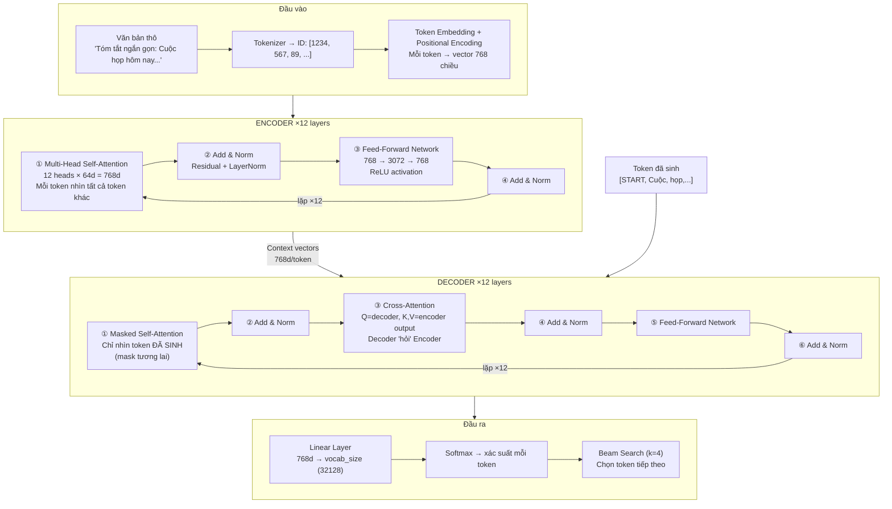
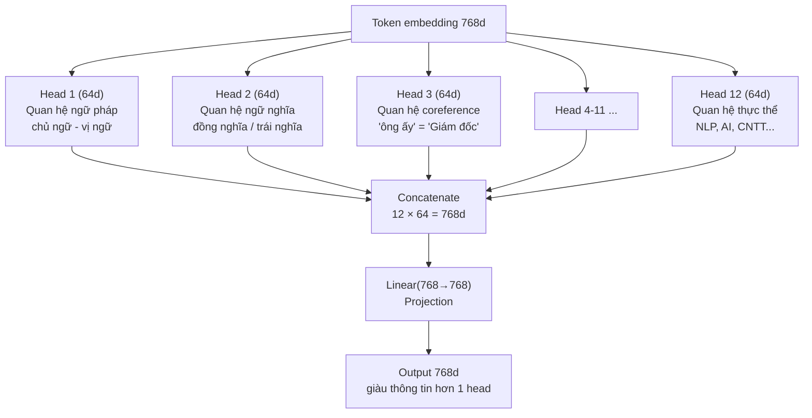
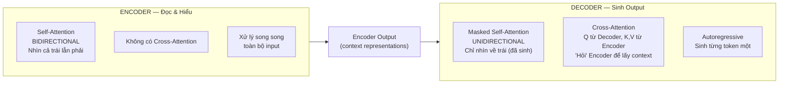
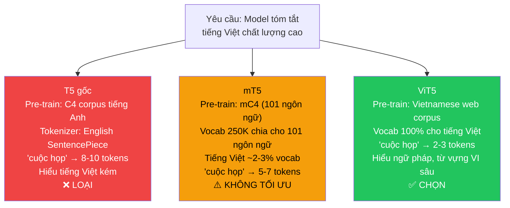

# Báo Cáo Chi Tiết — Smart Vietnamese Summarizer
## Phần 1: Kiến Trúc Transformer & Mô Hình ViT5

---

## 1. Bài Toán & Động Lực

### 1.1 Vấn đề thực tế

Con người hiện đại đối mặt với **information overload**:

- Một cuộc họp 2 tiếng → 10 trang biên bản → quản lý chỉ cần 5 bullet action items
- Một bài giảng 90 phút → 80 slide → sinh viên cần study notes có cấu trúc
- Một bài báo 2000 từ → nhà báo cần 1 đoạn tóm tắt để đăng lại

**Vấn đề**: Không phải ai cũng cần cùng loại output. Quản lý cần *ai làm gì, deadline khi nào*. Sinh viên cần *khái niệm, ví dụ, lỗi dễ nhầm*. Độc giả cần *1 đoạn liền mạch*.

**Giải pháp của đồ án**: Một hệ thống **controllable** — cùng văn bản đầu vào, người dùng chọn mode → nhận output đúng format họ cần.

```
INPUT:   Văn bản tiếng Việt (meeting notes / lecture / article)
         + Mode: concise | bullet | action_items | study_notes
         + Length: short | medium | long

OUTPUT:  Bản tóm tắt theo đúng mode và độ dài
         + Keywords nổi bật
         + Quality Estimate (điểm ước lượng chất lượng)
         + Latency (thời gian xử lý)
```

---

## 2. Nền Tảng Lý Thuyết: Tại Sao Transformer?

### 2.1 Giới hạn của RNN/LSTM — Tiền Transformer

Trước năm 2017, NLP dùng **RNN (Recurrent Neural Network)** — xử lý tuần tự từng từ:

```
"Cuộc" → [RNN] → h₁
"họp"  → [RNN + h₁] → h₂
"hôm"  → [RNN + h₂] → h₃
"nay"  → [RNN + h₃] → h₄
```

Hidden state `hₜ` là "bộ nhớ" chứa thông tin các từ đã đọc. **3 vấn đề nghiêm trọng:**

**① Vanishing Gradient**

Backpropagation qua 100 bước, gradient bị nhân với số < 1 mỗi bước → gradient → 0 → model không học được quan hệ xa.

Ví dụ thực tế:
```
"Giám đốc Nguyễn Văn A, người đã có 20 năm kinh nghiệm trong
 ngành CNTT và từng làm việc tại nhiều tập đoàn lớn trên toàn
 quốc, đã QUYẾT ĐỊNH TỪ CHỨC."
 ↑_________________________↑
 Cách nhau ~25 token → RNN quên chủ ngữ khi đọc đến vị ngữ
```

**② Không thể song song hóa**

RNN phải chờ bước t-1 xong mới chạy bước t → không tận dụng được GPU parallel computing → training cực chậm.

**③ LSTM cải thiện nhưng chưa đủ**

LSTM thêm cơ chế gate (forget/input/output) để kiểm soát bộ nhớ — giảm vanishing gradient nhưng vẫn tuần tự, vẫn giới hạn ~200–500 tokens thực tế.

| Vấn đề | RNN | LSTM | **Transformer** |
|---|---|---|---|
| Quan hệ từ xa | ❌ Quên | ⚠️ Giới hạn | ✅ Trực tiếp |
| Song song hóa | ❌ Không | ❌ Không | ✅ Hoàn toàn |
| Scalability | ❌ Kém | ❌ Kém | ✅ Tốt |

---

### 2.2 Transformer — "Attention Is All You Need" (2017)



---

## 3. Mổ Xẻ Từng Thành Phần

### 3.1 Token Embedding + Positional Encoding

**Tại sao cần Embedding?**

Model chỉ nhận số, không nhận chữ. Embedding ánh xạ token ID → vector trong không gian ngữ nghĩa:

```
"họp"  → ID: 567  → vector: [0.34, -0.12, 0.78, ..., 0.45]  (768 chiều)
"hội"  → ID: 891  → vector: [0.31, -0.09, 0.74, ..., 0.41]  (gần "họp")
"bàn"  → ID: 234  → vector: [0.12,  0.56, 0.23, ..., 0.89]  (xa "họp")
```

Sau training, các từ gần nghĩa → vector gần nhau trong không gian 768 chiều.

**Tại sao cần Positional Encoding?**

Self-Attention xử lý song song → mất thứ tự từ!

```
"Tôi ăn cơm" vs "Cơm ăn tôi"
→ Nếu chỉ có token embedding: 3 vector giống nhau, chỉ thứ tự khác
→ Model không phân biệt được!
```

Giải pháp: cộng thêm vector mã hóa vị trí:

```
Position 0:  [sin(0/10000^0), cos(0/10000^0), sin(0/10000^2), ...]
Position 1:  [sin(1/10000^0), cos(1/10000^0), sin(1/10000^2), ...]
...

Final input token t = Embedding(t) + PositionEncoding(pos(t))
```

**ViT5 dùng Relative Position Bias (T5 style)**: thay vì mã hóa vị trí tuyệt đối (vị trí 1, 2, 3...), mã hóa **khoảng cách tương đối** giữa cặp token (cách nhau 1, 2, 3... vị trí). Linh hoạt hơn cho input độ dài khác nhau.

---

### 3.2 Self-Attention — Chi Tiết Toán Học

**Công thức:**
$$\text{Attention}(Q, K, V) = \text{softmax}\!\left(\frac{QK^T}{\sqrt{d_k}}\right)\! V$$

**Diễn giải bằng ngôn ngữ tự nhiên:**

- **Q (Query)**: "Tôi đang tìm kiếm ngữ cảnh liên quan đến gì?"
- **K (Key)**: "Tôi có thể cung cấp ngữ cảnh về gì?"
- **V (Value)**: "Thông tin thực tế của tôi là gì?"

**Ví dụ step-by-step — Câu: "Cuộc họp quan trọng bị hoãn"**

```
Bước 1: Tạo Q, K, V cho mỗi token
  Mỗi embedding (768d) nhân với 3 ma trận weight:
  W_Q, W_K, W_V ∈ ℝ^(768×64) → mỗi vector 64 chiều

  Token "hoãn" (768d):
    × W_Q → Q_hoãn (64d): "Tôi muốn biết TẠI SAO tôi bị hoãn"
    × W_K → K_hoãn (64d): "Tôi cung cấp thông tin về sự hoãn"
    × W_V → V_hoãn (64d): "Thông tin thực: trạng thái bị hoãn"

Bước 2: Tính Attention Score (Q·K^T)
  Q_hoãn · K_Cuộc  = 1.8  ← ít liên quan
  Q_hoãn · K_họp   = 3.2  ← liên quan vừa
  Q_hoãn · K_quan  = 2.1
  Q_hoãn · K_trọng = 2.4
  Q_hoãn · K_bị    = 5.7  ← RẤT liên quan! ("bị" + "hoãn" đi đôi)
  Q_hoãn · K_hoãn  = 4.9  ← chính nó

Bước 3: Scale (÷√64 = 8)
  [0.225, 0.400, 0.263, 0.300, 0.713, 0.613]

Bước 4: Softmax → Attention weights (tổng = 1)
  [0.08, 0.12, 0.09, 0.10, 0.32, 0.29]
   Cuộc  họp   quan  trọng  bị   hoãn

Bước 5: Weighted sum of Values
  New_repr("hoãn") = 0.08×V_Cuộc + 0.12×V_họp
                   + 0.09×V_quan  + 0.10×V_trọng
                   + 0.32×V_bị    + 0.29×V_hoãn

  → Vector "hoãn" giờ CHỨA ngữ cảnh từ "bị" (32%) và bản thân (29%)
  → Model hiểu đây là "bị hoãn" chứ không phải tự hoãn
```

**Tại sao scale bằng √d_k?**

Với d_k=64, tích vô hướng Q·K có thể rất lớn (√64 ≈ 8). Nếu không scale, softmax sẽ bị saturate — gradient gần 0 → training cực chậm.

---

### 3.3 Multi-Head Attention — Capture Nhiều Loại Quan Hệ

1 attention head chỉ học được 1 loại pattern. Multi-head cho phép học song song nhiều loại:



**Ví dụ thực tế — câu "An đề xuất tăng lương, và ông ấy sẽ gửi đề xuất vào thứ Sáu":**

- Head 1 (coreference): "ông ấy" = "An" — liên kết 2 vị trí xa nhau
- Head 2 (temporal): "thứ Sáu" là deadline của "gửi đề xuất"
- Head 3 (semantic): "đề xuất" và "tăng lương" liên quan chặt

> ViT5-base: **12 heads × 64d = 768d**. ViT5-large dùng 16 heads × 64d = 1024d.

---

### 3.4 Feed-Forward Network (FFN)

```
FFN(x) = max(0, xW₁ + b₁)W₂ + b₂
         ↑
         ReLU activation

Dimensions: 768 → 3072 → 768  (expand 4× rồi compress)
```

**Tại sao cần FFN sau Attention?**

- **Attention** = tổng hợp thông tin *giữa các token* (inter-token)
- **FFN** = xử lý thông tin *trong từng token* (intra-token)

Phép ẩn dụ:
> Attention = "nghe ngóng, thu thập thông tin từ môi trường xung quanh"
> FFN = "ngồi suy nghĩ, tiêu hóa thông tin vừa thu thập"

FFN chiếm phần lớn tham số của model (768×3072×2 = ~4.7M params/layer × 12 layers ≈ 56M chỉ riêng FFN).

---

### 3.5 Add & Norm — Ổn Định Training

```
Output = LayerNorm(x + SubLayer(x))
         ↑ residual   ↑ attention hoặc FFN
```

**Residual Connection (`x +`):**

Gradient có đường đi thẳng qua shortcut → không bị vanishing dù model 24 layers (12 encoder + 12 decoder).

```
Không có residual:    x → [Layer 1] → [Layer 2] → ... → [Layer 12]
                      gradient phải qua 12 cửa → nhỏ dần

Có residual:          gradient có thể bypass qua shortcut
                      → model 12 layers vẫn train được
```

**Layer Normalization:**

Chuẩn hóa activation vector về mean=0, std=1 trên chiều feature → training ổn định, không bị exploding/vanishing activation.

---

### 3.6 Encoder vs Decoder — Sự Khác Biệt Quan Trọng



**Tại sao Decoder cần Masked Self-Attention?**

Khi inference, từ tương lai chưa tồn tại. Nếu không mask, model sẽ "nhìn vào tương lai" — thông tin bị rò rỉ, model học cách copy-paste thay vì tự sinh.

```
Đang sinh token thứ 3 ("quyết"):
  ✅ Được nhìn: <START>, "Cuộc", "họp"  (đã sinh)
  ❌ Không nhìn: "định", "tăng", "lương" (chưa tồn tại)

Mask matrix (upper triangle = -∞):
         <S>  Cuộc  họp   quyết định
  <S>  [ 0,   -∞,   -∞,   -∞,   -∞  ]
  Cuộc [ 0,    0,   -∞,   -∞,   -∞  ]
  họp  [ 0,    0,    0,   -∞,   -∞  ]
  quyết[ 0,    0,    0,    0,   -∞  ]
  định [ 0,    0,    0,    0,    0  ]

Sau softmax: -∞ → 0 (không attend)
```

**Cross-Attention — Cầu Nối Encoder-Decoder:**

```
Decoder đang sinh từ "quyết":
  Q = vector của "quyết" (từ Decoder Masked Self-Attention)
  K = encoder output của tất cả input tokens
  V = encoder output của tất cả input tokens

  Q("quyết") · K("họp")      = 4.2  ← relate
  Q("quyết") · K("tăng")     = 5.1  ← strongly relate
  Q("quyết") · K("lương")    = 4.8  ← strongly relate
  Q("quyết") · K("ngân sách")= 3.9

  → Khi sinh "quyết", decoder chú ý nhiều đến "tăng", "lương" từ input
  → Điều này giúp decoder quyết định token tiếp theo là "định"
```

---

## 4. T5 & ViT5 — Lý Do Lựa Chọn

### 4.1 T5: Text-to-Text Transfer Transformer

Google (2020) đề xuất ý tưởng: format **MỌI** NLP task thành text→text:

```
Task Summarization:   "summarize: {document}"         → "{summary}"
Task Translation:     "translate English to VI: Hello" → "Xin chào"
Task Classification:  "sentiment: I love this film"    → "positive"
Task Q&A:             "question: What is AI? context: ..." → "{answer}"
```

**Lợi ích của thiết kế này:**
1. Một architecture duy nhất cho tất cả task
2. Pre-train 1 lần, fine-tune bất kỳ task nào
3. Prefix là instruction — model học hiểu "summarize:" nghĩa là phải tóm tắt

Trong đồ án, ta khai thác cơ chế này để **controllable generation**: thay đổi prefix → output style khác nhau.

---

### 4.2 So Sánh ViT5 vs T5 vs mT5



**Tokenization efficiency — Tại sao quan trọng:**

```
Câu: "Cuộc họp ban quản lý thảo luận về ngân sách marketing quý 3"

T5  tokenizer:  [cu, ộc, _h, ọp, _ban, _qu, ản, _l, ý, ...]  → ~18 tokens
mT5 tokenizer:  [Cuộc, _họp, _ban, _quản, _lý, ...]           → ~12 tokens
ViT5 tokenizer: [Cuộc_họp, _ban_quản_lý, _thảo_luận, ...]     → ~7 tokens

Với max_source_length=512:
  T5:   512/18 ≈ 28 câu tiếng Việt
  mT5:  512/12 ≈ 43 câu
  ViT5: 512/7  ≈ 73 câu  ← FIT GẦN 2.5× nhiều nội dung!
```

**ViT5-base — Thông số kỹ thuật:**

| Thông số | Giá trị |
|---|---|
| Architecture | T5-style Encoder-Decoder |
| Encoder / Decoder layers | 12 / 12 |
| Hidden dimension (d_model) | 768 |
| Attention heads | 12 |
| FFN intermediate dim | 3072 |
| Vocabulary size | 32,128 |
| Max sequence length | 512 |
| Total parameters | ~250M |
| Pre-training corpus | Vietnamese CommonCrawl + Wikipedia |

---

## 5. Tại Sao Abstractive Seq2Seq?

### 5.1 Abstractive vs Extractive

| Phương pháp | Cách hoạt động | Phù hợp 4 modes? | Ví dụ |
|---|---|---|---|
| **Extractive** | Chọn & ghép câu từ bài gốc | ❌ Không | Lấy câu 1, 5, 12 |
| **Abstractive** | Hiểu → viết lại câu mới | ✅ Có | Tóm gọn bằng ngôn ngữ riêng |

**Reasoning:**

```
Yêu cầu: 4 output modes khác nhau từ cùng 1 input

Extractive approach:
  → Chỉ copy câu từ gốc
  → "action_items" mode: cần "Người phụ trách: An / Deadline: Thứ Sáu"
     nhưng câu gốc "An phụ trách báo cáo trước thứ Sáu" không có format này
  → Không thể tạo structured format tùy ý
  → ❌ LOẠI

Abstractive Seq2Seq:
  → Model hiểu nội dung, viết lại theo bất kỳ format nào
  → Thay đổi prefix → thay đổi "instruction" → thay đổi output style
  → ✅ CHỌN
```

### 5.2 Tại Sao Fine-tune Thay Vì Zero-shot?

```
Zero-shot (dùng model chưa fine-tune):
  Input:  "Tóm tắt: Cuộc họp hôm nay thảo luận về..."
  Output: "Cuộc họp hôm nay thảo luận về... Cuộc họp hôm nay..."
           ↑ Lặp lại input, không tóm tắt được
  ROUGE-1 ≈ 0.15-0.20 → Quá thấp

Fine-tuned (học từ dataset):
  Input:  "Tóm tắt ngắn gọn: Cuộc họp hôm nay thảo luận về..."
  Output: "Cuộc họp quyết định 3 điểm chính: tăng ngân sách..."
           ↑ Coherent, đúng ý, đúng format
  ROUGE-1 ≈ 0.38-0.45 → Tốt hơn nhiều

Kết luận: Fine-tune vì có dataset (VietNews) + GPU (Colab T4)
```

---

*→ Tiếp theo: Phần 2 — Kỹ Thuật Chi Tiết, Training & Đánh Giá*
