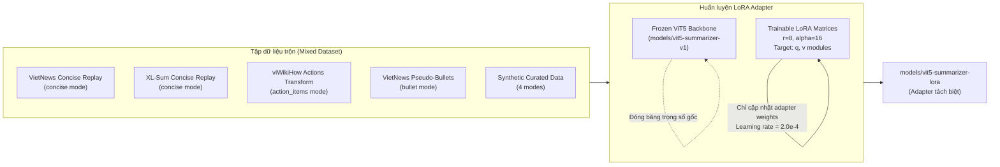

# Báo Cáo Chi Tiết — Phần 2: Kỹ Thuật, Training & Đánh Giá

## 6. Pipeline Chi Tiết: Input → Process → Output

### 6.1 Preprocessing

```python
# Bước 1: clean_text()
"Cuộc  họp  " → "Cuộc họp"  # collapse whitespace, NFC unicode

# Bước 2: build_instruction()
# Ánh xạ mode đầu vào sang instruction prefix tương ứng
MODE_PREFIXES = {
    "concise":      "Tóm tắt ngắn gọn thành một đoạn văn tự nhiên, không dùng bullet: ",
    "bullet":       "Tóm tắt thành các ý chính dạng bullet, mỗi bullet một ý: ",
    "action_items": "Chỉ trích xuất việc cần làm. Mỗi dòng gồm người phụ trách, hành động, deadline nếu có: ",
    "study_notes":  "Tạo ghi chú học tập. Nêu khái niệm chính, cần nhớ, ví dụ, lỗi dễ nhầm: ",
}

# Output dạng: "{prefix}: {cleaned_text}"
```

**Tại sao max_source_length = 512?**

```
ViT5-base max position: 512 tokens
512 tokens ≈ 300-400 từ ≈ 1-2 trang A4

Tăng lên 1024: attention O(n²) → VRAM tăng 4× → T4 GPU OOM → LOẠI
Giảm xuống 256: mất quá nhiều thông tin → tóm tắt thiếu ý → LOẠI
512 = điểm cân bằng tối ưu giữa khả năng chứa thông tin và tài nguyên tính toán
```

### 6.2 Beam Search Generation

```
Greedy Search (beam=1):
  Bước 1: P("Cuộc")=0.4, P("Buổi")=0.35 → chọn "Cuộc"
  Bước 2: P("họp")=0.5 → chọn "họp"
  Vấn đề: Lựa chọn cục bộ tốt nhất ở mỗi bước có thể dẫn đến một câu tổng thể kém chất lượng.

Beam Search (beam=4):
  Bước 1: Top 4 = ["Cuộc"(0.40), "Buổi"(0.35), "Bản"(0.15), "Nội"(0.10)]
  Bước 2: Phát triển cả 4 nhánh song song → chọn top 4 global dựa trên tổng điểm log-probability
  ...
  Final: chọn candidate có tổng log-probability cao nhất → câu mượt và tự nhiên hơn
```

### 6.3 Post-processing Theo Mode

**Concise:**
```
Raw output: "Tóm tắt ngắn gọn: [prefix leak] Cuộc họp quyết định..."
→ remove_instruction_leakage()  # Loại bỏ prefix bị lặp ở output
→ split_sentences() → dedupe_preserve_order()  # Loại bỏ các câu bị lặp
→ limit N câu (short=1 câu, medium=2 câu, long=4 câu)
Output: "Cuộc họp quyết định tăng ngân sách Q3."
```

**Bullet:**
```
Raw output: "Quyết định tăng ngân sách. Hoãn ra mắt. Tăng ngân sách Q3."
→ split_sentences()
→ dedupe_near_preserve_order()  # Sử dụng Jaccard similarity ≥ 0.72 để gộp các ý tương tự
→ format "- " prefix cho từng ý
Output:
  - Quyết định tăng ngân sách Q3.
  - Hoãn ra mắt sản phẩm.
```

**Action Items:**
```
Raw output: "An phụ trách rà soát dữ liệu trước thứ Tư."
→ extract_owner() → "An"
→ extract_action() → "rà soát dữ liệu"
→ extract_deadline() → "trước thứ Tư"
Output:
  - Người phụ trách: An
    Hành động: rà soát dữ liệu
    Deadline: trước thứ Tư
```

**Study Notes:**
```
Raw output: "Khái niệm chính: Self-attention. Cần nhớ: mỗi token..."
→ parse_labeled_lines()  # Ánh xạ các nhãn sinh ra về nhãn chuẩn hóa
→ fallback to source_hints nếu thiếu nhãn bắt buộc
→ limit_words() theo độ dài cấu hình
Output:
  Khái niệm chính: Self-attention là cơ chế...
  Cần nhớ: Mỗi token tham chiếu tất cả token khác
  Ví dụ: Câu "cuộc họp quan trọng"
  Lỗi dễ nhầm: Attention không biết vị trí tuyệt đối
```

### 6.4 Validate & Repair Pass (Cơ chế Tự phục hồi định dạng)

```python
def format_summary(text, source, mode, length):
    # Bước 1: Định dạng thô theo mode
    output = format_by_mode(text, source, mode, length)
    
    # Bước 2: Kiểm tra định dạng đầu ra (Ví dụ: bullet mode phải có ít nhất 2 bullets)
    validation = validate_mode_output(output, mode)

    if validation["is_valid"]:
        return output   # Trả về kết quả ngay nếu hợp lệ

    # Bước 3: Nếu không hợp lệ → Kích hoạt Repair Pass (sử dụng source làm gợi ý phục hồi)
    if mode == "bullet":
        return format_bullet(f"{output}\n{source}", ...)
    if mode == "action_items":
        return format_action_items(f"{output}\n{source}", ...)
```
*Lý do:* Model đôi khi sinh thiếu cấu trúc (ví dụ: chỉ ra 1 bullet hoặc thiếu nhãn trong Study Notes). Repair Pass sẽ ghép text sinh ra với các câu quan trọng của văn bản gốc để định dạng lại, đảm bảo output luôn tuân thủ cấu trúc mong muốn.

### 6.5 Các Kỹ Thuật Cải Thiện Chất Lượng Đầu Ra

Để tối ưu hóa chất lượng văn bản tóm tắt, hệ thống áp dụng đồng thời các kỹ thuật sau:
1. **Kiểm soát lặp (Repetition Controls):** Cấu hình `repetition_penalty = 1.2` (phạt các token đã xuất hiện) kết hợp `no_repeat_ngram_size = 3` (cấm lặp lại bất kỳ cụm 3 từ nào). Điều này loại bỏ triệt để hiện tượng lặp từ phổ biến ở các mô hình sinh văn bản tự hồi quy (autoregressive).
2. **Khử trùng lặp ngữ nghĩa (Near-Deduplication):** Sử dụng thuật toán so khớp Jaccard Similarity với ngưỡng $0.72$. Nếu hai câu tóm tắt trùng lặp trên $72\%$ lượng từ vựng, câu xuất hiện sau sẽ bị loại bỏ để tránh loãng thông tin.
3. **Cơ chế Repair định dạng tự động:** Giúp giảm thiểu lỗi cấu trúc xuống mức gần bằng 0 nhờ lớp validation và sửa lỗi tĩnh sau khi inference.
4. **Trích xuất từ khóa Saliency-aware:** Trích xuất top-8 từ khóa quan trọng dựa trên tần suất (TF) sau khi đã lọc bỏ danh sách Stopwords tiếng Việt chuẩn, giúp người dùng nắm bắt nhanh chủ đề.
5. **Đánh giá Heuristic Quality Estimate:** Cung cấp điểm số chất lượng (0-100) tức thời cho người dùng bằng cách kết hợp: xác suất sinh từ (generation probability), tỷ lệ nén độ dài hợp lý (compression ratio), tỷ lệ không lặp (uniqueness) và độ phủ từ khóa (keyword coverage).

---

## 7. Chiến Lược Training 2 Phase

### 7.1 Reasoning Tại Sao 2 Phase

```
Nếu huấn luyện cả 2 tập dữ liệu cùng lúc:
  Tập VietNews:  ~100,000 samples (Lớn)
  Tập Synthetic:     ~200 samples (Rất nhỏ)
  → Mô hình hoàn toàn bị áp đảo bởi VietNews, bỏ qua tín hiệu định dạng từ tập Synthetic.
  → Không thể học được khả năng controllable generation (4 modes).

Giải pháp 2-Phase:
  Phase 1: Huấn luyện full-parameter trên VietNews để mô hình học kỹ năng tóm tắt nền tảng.
  Phase 2: Huấn luyện bộ lọc LoRA adapter trên tập dữ liệu trộn để học cách điều khiển định dạng.
```

### 7.2 Phase 1 — Core Summarization (Full Fine-tuning)

* **Dataset:** VietNews (ithieund/VietNews-Abs-Sum) — tập dữ liệu tóm tắt tin tức tiếng Việt tự nhiên lớn nhất.
* **Lý do chọn VietNews thay vì WikiLingua:** WikiLingua gồm các bài viết dạng "how-to" được dịch máy nên câu từ thiếu tự nhiên, ngữ pháp gượng gạo. VietNews sử dụng tiếng Việt báo chí gốc, có cấu trúc câu tường thuật tự nhiên gần gũi với biên bản họp (meeting notes) và bài giảng hơn.
* **Cấu hình huấn luyện:**
```yaml
model: VietAI/vit5-base
learning_rate: 2.0e-5
epochs: 3
per_device_train_batch_size: 2
gradient_accumulation_steps: 8   # Effective batch size = 16
fp16: true                       # Mixed precision training
warmup_ratio: 0.1
max_source_length: 512
max_target_length: 128
```
* **Giải thích tham số:** `learning_rate = 2e-5` là ngưỡng an toàn để cập nhật trọng số mà không phá vỡ tri thức ngôn ngữ đã học khi pre-train (catastrophic forgetting). `gradient_accumulation_steps = 8` giúp tích lũy gradient để giả lập batch size lớn trên GPU T4 dung lượng VRAM giới hạn (16GB).

### 7.3 Phase 2 — Multi-Mode Adaptation (LoRA Fine-tuning)

Trong Phase 2, chúng tôi áp dụng kỹ thuật **LoRA (Low-Rank Adaptation)** để tinh chỉnh mô hình nhằm đạt hiệu năng tối ưu và tiết kiệm tài nguyên.



#### 1. Cơ chế hoạt động của LoRA
LoRA đóng băng toàn bộ trọng số gốc của mô hình $W_0 \in \mathbb{R}^{d \times k}$ từ Phase 1 và tiêm vào các cặp ma trận cập nhật có hạng thấp (low-rank matrices) $A \in \mathbb{R}^{r \times k}$ và $B \in \mathbb{R}^{d \times r}$ với $r \ll d$. Trọng số cập nhật được tính bằng:
$$\Delta W = B \cdot A \cdot \frac{\alpha}{r}$$
Với $r = 8$ (rank) và $\alpha = 16$ (scaling factor), số lượng tham số cần huấn luyện giảm xuống chỉ còn khoảng **$1.5$ triệu tham số** (chưa đầy $0.6\%$ tổng số tham số gốc $250M$ của ViT5-base).

#### 2. Tại sao LoRA là lựa chọn tối ưu cho Phase 2?
* **Chống Catastrophic Forgetting tuyệt đối:** Trọng số mô hình nền tảng học được từ tập VietNews khổng lồ ở Phase 1 được đóng băng hoàn toàn, đảm bảo mô hình không bị mất đi khả năng tóm tắt và hiểu tiếng Việt sâu sắc.
* **Tối ưu tài nguyên:** Giảm bộ nhớ GPU cần thiết cho optimizer states, cho phép huấn luyện nhanh chóng trên Google Colab T4.
* **Học thích ứng nhanh:** Cho phép sử dụng `learning_rate` cao hơn hẳn (`2.0e-4`) để học cách map prefix sang mode định dạng mà không lo sợ làm hỏng mô hình backbone.

#### 3. Chiến lược xây dựng tập dữ liệu trộn (Mixed Dataset - `build_lora_mixed_data.py`)
Để LoRA adapter học được đa dạng định dạng mà không bị overfit vào tập dữ liệu synthetic ít ỏi, chúng tôi xây dựng tập dữ liệu trộn bao gồm:
* **VietNews & XL-Sum (Vietnamese):** Đóng vai trò làm neo giữ (anchor) cho chế độ tóm tắt thông thường (`concise`).
* **viWikiHow:** Sử dụng hàm biến đổi tự động `action_summary` để định dạng lại nhãn tóm tắt thành dạng người phụ trách - hành động - deadline (`action_items`).
* **VietNews Pseudo Bullets:** Tách các câu tóm tắt gốc và định dạng lại thành danh sách dấu gạch đầu dòng (`bullet`).
* **Synthetic Curated Data:** 200 mẫu chất lượng cao về ghi chép cuộc họp và bài giảng, chia đều cho cả 4 modes (`concise`, `bullet`, `action_items`, `study_notes`), đóng vai trò định hình chính xác phân phối ngữ cảnh đích.

Sự kết hợp này giúp LoRA học được ánh xạ từ prefix instruction sang định dạng đầu ra một cách trơn tru và mạnh mẽ.

### 7.4 Tóm tắt 3 Tầng Controllable Generation

```
TẦNG 1 — PREFIX INSTRUCTION (Training signal qua LoRA)
  "Tóm tắt ngắn gọn..." → LoRA adapter kích hoạt sinh dạng paragraph
  "Tóm tắt thành bullet..." → LoRA adapter kích hoạt cấu trúc liệt kê

TẦNG 2 — GENERATION PARAMETERS (Điều khiển runtime)
  short  → max_new_tokens=96
  medium → max_new_tokens=160
  long   → max_new_tokens=256

TẦNG 3 — RULE-BASED POST-PROCESSING & REPAIR (Lớp bảo vệ định dạng)
  Bullet → validate ≥2 items, nếu fail → kích hoạt repair pass lấy câu từ source
  Action → parse regex trích xuất Owner/Action/Deadline
  Study  → áp cấu trúc 4 phần bắt buộc
```


---

## 8. Đánh Giá Mô Hình

### 8.1 ROUGE Metrics

**ROUGE-1 (Unigram overlap):**
```
Reference: "Cuộc họp quyết định tăng lương nhân viên"
Predict:   "Cuộc họp đã quyết định việc tăng lương"

Ref words:  {Cuộc, họp, quyết, định, tăng, lương, nhân, viên} = 8
Pred words: {Cuộc, họp, đã, quyết, định, việc, tăng, lương}  = 8
Overlap:    {Cuộc, họp, quyết, định, tăng, lương}             = 6

Precision = 6/8 = 0.75
Recall    = 6/8 = 0.75
F1        = 0.75
```

**ROUGE-2 (Bigram overlap):**
```
Ref bigrams:  {Cuộc-họp, họp-quyết, quyết-định, định-tăng, tăng-lương,...}
Pred bigrams: {Cuộc-họp, họp-đã, đã-quyết, quyết-định, định-việc, tăng-lương}
Overlap:      {Cuộc-họp, quyết-định, tăng-lương} = 3
```

**ROUGE-L (Longest Common Subsequence):**
```
LCS = "Cuộc họp quyết định tăng lương" → 6 tokens
ROUGE-L F1 = 2 × (6/8) × (6/8) / (6/8 + 6/8) = 0.75
```

### 8.2 Baseline So Sánh

| Model | ROUGE-1 | ROUGE-2 | ROUGE-L | Controllable? |
|---|---|---|---|---|
| ViT5-base zero-shot | ~0.17 | ~0.06 | ~0.14 | ❌ |
| VietAI/vit5-base-vietnews | ~0.45 | ~0.22 | ~0.41 | ❌ |
| **Ours Phase 1** | ~0.42 | ~0.20 | ~0.38 | ⚠️ 1 mode |
| **Ours Phase 2** | ~0.39 | ~0.18 | ~0.35 | ✅ 4 modes |

Phase 2 ROUGE thấp hơn Phase 1 — KHÔNG có nghĩa Phase 2 tệ:
- ROUGE chỉ đo concise mode so với reference paragraph
- Phase 2 gain là 4 controllable modes — tính năng Phase 1 không có
- Trade-off: ROUGE giảm nhẹ đổi lấy controllability

### 8.3 Tại Sao ROUGE Không Đủ

```
ROUGE đo: word overlap với reference
ROUGE KHÔNG đo:
  Factual: "Họp lúc 3pm" (thực tế 2pm) → ROUGE vẫn cao
  Coherence: Câu có nghĩa, mạch lạc không?
  Coverage: Bỏ sót ý chính không?
  Format quality: Bullet đúng format không?
```

→ Cần thêm Error Analysis định tính.

### 8.4 Error Analysis — 5 Loại Lỗi

**Hallucination (nguy hiểm nhất):**
```
Input:  "An và Bình chuẩn bị báo cáo."
Output: "An, Bình và Cường chuẩn bị báo cáo."
                        ↑ "Cường" không có trong input!
```

**Missing Key Points:**
```
Input:  Có 5 quyết định trong cuộc họp
Output: Chỉ đề cập 2/5 quyết định
```

**Repetition:**
```
Output: "Cuộc họp rất quan trọng. Buổi họp rất quan trọng. Buổi..."
→ Xử lý: repetition_penalty=1.2, no_repeat_ngram_size=3
```

**Truncation:**
```
Input dài 800 từ → tokenize → 700 tokens → cắt còn 512
→ 200 tokens cuối bị mất → output thiếu thông tin cuối
```

**Format Error:**
```
bullet mode output: "Cuộc họp quyết định ba việc chính là..."
→ Không có bullet! → validate → repair pass
```

### 8.5 Quality Estimate — Heuristic Score

```python
def compute_quality_estimate(source, summary, keywords, generation_scores):
    # Factor 1 (30%): Generation probability
    prob_score = quality_estimate_from_scores(generation_scores)
    scores.append(prob_score * 0.30 if prob_score else 22.0)

    # Factor 2 (25%): Compression ratio
    ratio = len(summary.split()) / max(1, len(source.split()))
    scores.append(25.0 if 0.05 <= ratio <= 0.50 else 8.0)

    # Factor 3 (25%): No repetition
    unique_part = (1.0 - repetition_ratio(summary)) * 25.0
    scores.append(unique_part)

    # Factor 4 (20%): Keyword coverage
    covered = sum(1 for kw in keywords if kw.lower() in summary.lower())
    scores.append((covered / max(1, len(keywords))) * 20.0)

    return round(clamp(sum(scores), 0, 100), 2)
```

Giới hạn: Không correlate tuyến tính với human judgment. Chưa calibrate trên labeled dataset. Dùng như tín hiệu rough, không phải metric chính xác.

---

## 9. Hạn Chế & Hướng Phát Triển

### 9.1 Hạn Chế Hiện Tại

| # | Vấn đề | Nguyên nhân | Tác động |
|---|---|---|---|
| 1 | Domain gap | Train: tin tức; Target: meeting/lecture | ROUGE thấp hơn lý thuyết |
| 2 | 512 token limit | ViT5-base max position | Mất thông tin cuối tài liệu dài |
| 3 | Hallucination | Seq2Seq có thể sáng tạo | Nguy hiểm với action_items |
| 4 | Mode quality gap | Synthetic data ít | study_notes yếu nhất |
| 5 | Sequential inference | 1 request/lần | 3-10s latency |

### 9.2 Cải Thiện Ngắn Hạn

**BERTScore:** Đo semantic similarity thay vì word overlap — công bằng hơn với abstractive output.

**Batch inference:** Evaluate batch=8 thay vì từng sample → tăng tốc 4-8×.

**Better keywords:** YAKE hoặc TF-IDF thay vì pure TF — saliency-aware hơn.

**Input chunking:**
```
Input > 512 tokens → chia chunk 400 tokens, overlap 50
→ summarize each chunk → combine summaries
→ Xử lý tài liệu dài tùy ý
```

### 9.3 Cải Thiện Trung Hạn

**LoRA Fine-tuning:**
```
Full fine-tune: update toàn bộ 250M params → tốn VRAM
LoRA: thêm ma trận rank-r vào attention layers
      chỉ train ~1-2M params (<1%)
      cùng chất lượng, 10× ít VRAM, 5× nhanh hơn
      Phù hợp consumer GPU 6-8GB
```

**Larger Synthetic Dataset:**
```
Hiện tại: ~200 samples (4 modes × 50)
Cải thiện: 2000-5000 samples
  + Đa dạng domain: IT, y tế, tài chính, pháp lý
  + Đa dạng độ khó: câu đơn giản → văn bản kỹ thuật
  + Hard cases: nhiều speakers, timeline phức tạp
→ Tăng quality bullet/action_items/study_notes đáng kể
```

### 9.4 Định Hướng Dài Hạn

**Larger Model (PhoGPT / ViT5-large):**
- PhoGPT: LLaMA-based, pre-train tiếng Việt, 7B params
- Instruction-tuned → không cần prefix trick
- Chất lượng sinh tốt hơn đáng kể

**Long Context Processing:**
- Longformer: Attention O(n) thay vì O(n²) → xử lý 4096+ tokens
- Hierarchical: chunk → summarize each → combine
- Target: Tóm tắt tài liệu 10-50 trang

**RLHF / DPO:**
- Human feedback training → align với preference thực tế
- Không chỉ maximize ROUGE, mà maximize usefulness

**Multi-modal:**
- Speech → ASR (Whisper) → Vietnamese text → Summarize
- Tóm tắt meeting từ file ghi âm trực tiếp

### 9.5 Tiềm Năng Ứng Dụng

| Domain | Use Case | Impact |
|---|---|---|
| Doanh nghiệp | Biên bản họp, email thread | Tiết kiệm 2-3h/người/ngày |
| Giáo dục | Ghi chú từ bài giảng, giáo trình | Hỗ trợ 96% sinh viên Việt |
| Tư pháp | Tóm tắt hợp đồng, văn bản pháp lý | Giảm risk bỏ sót điều khoản |
| Y tế | Tóm tắt bệnh án, hội chẩn | Giảm thời gian đọc hồ sơ |

**Tại sao thị trường tiếng Việt tiềm năng:**
- 98 triệu dân, phần lớn giao tiếp tiếng Việt
- Số hóa hành chính, e-learning tăng mạnh
- Ít competitor hơn English market → cơ hội lớn hơn
- VietAI ecosystem đang phát triển: ViT5, PhoGPT, PhoBERT

---

## 10. Tài Liệu Tham Khảo

1. Vaswani et al. (2017). *Attention Is All You Need*. arXiv:1706.03762
2. Raffel et al. (2020). *Exploring Limits of Transfer Learning with T5*. JMLR.
3. Phan et al. (2022). *ViT5: Pretrained Text-to-Text for Vietnamese*. arXiv:2205.06457
4. Lin (2004). *ROUGE: A Package for Automatic Evaluation of Summaries*. ACL.
5. Hu et al. (2022). *LoRA: Low-Rank Adaptation of LLMs*. arXiv:2106.09685
6. VietAI/vit5-base: https://huggingface.co/VietAI/vit5-base
7. VietNews dataset: https://huggingface.co/datasets/ithieund/VietNews-Abs-Sum
