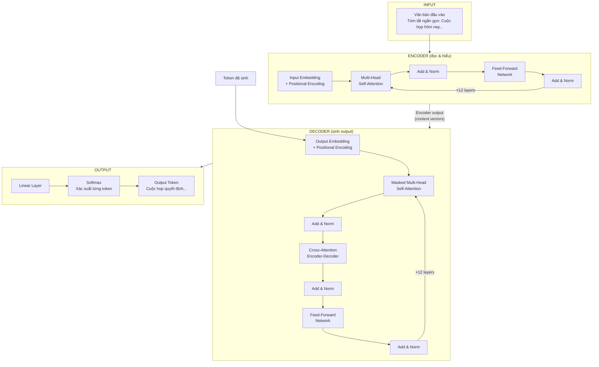
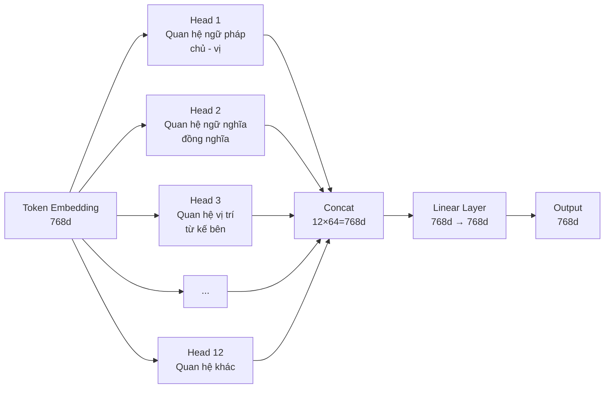
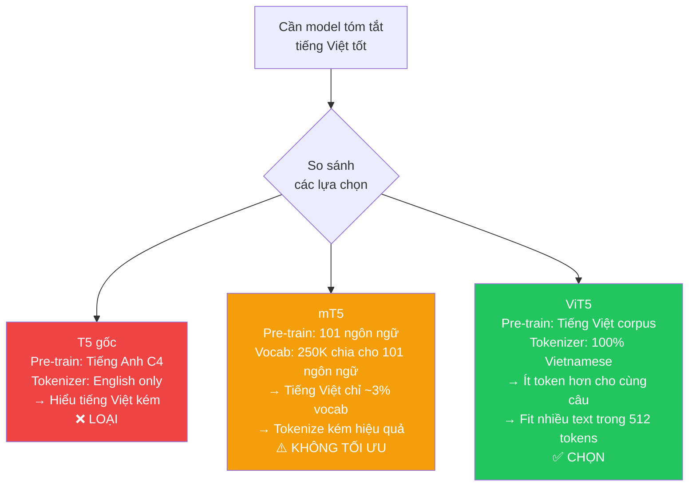

# Thuyết Trình Đồ Án: Smart Vietnamese Summarizer
## Phần 1 — Kiến Trúc Transformer & Mô Hình ViT5

---

## 1. Bối Cảnh: Tại Sao Cần Transformer?

### 1.1 Giới Hạn Của RNN/LSTM

Trước Transformer (2017), NLP dùng RNN/LSTM — xử lý **tuần tự** từng từ:

```
"Cuộc" → [RNN] → h1
"họp"  → [RNN+h1] → h2
"quan" → [RNN+h2] → h3
"trọng"→ [RNN+h3] → h4
```

**3 vấn đề chết người:**

| Vấn đề | Mô tả | Hậu quả |
|---|---|---|
| Vanishing Gradient | Gradient → 0 qua 100 bước backprop | Không học được quan hệ xa |
| Sequential | Phải đọc từng từ tuần tự | Không tận dụng GPU parallel |
| Giới hạn bộ nhớ | Hidden state chứa "toàn bộ lịch sử" | Quên từ ở đầu câu |

**Ví dụ thực tế — RNN thất bại:**
> *"Giám đốc Nguyễn Văn A, người đã có 20 năm kinh nghiệm trong ngành CNTT và từng làm việc tại nhiều tập đoàn lớn trên toàn quốc, **đã quyết định từ chức**."*

→ RNN đến "đã quyết định" đã quên "Giám đốc Nguyễn Văn A" — cách nhau quá xa.

---

## 2. Transformer: "Attention Is All You Need" (2017)

### 2.1 Tổng Quan Kiến Trúc



---

### 2.2 Self-Attention — Trái Tim Của Transformer

**Ý tưởng:** Mỗi từ tự hỏi *"Từ nào trong câu liên quan đến tôi nhất?"*

**Công thức:**
$$\text{Attention}(Q, K, V) = \text{softmax}\left(\frac{QK^T}{\sqrt{d_k}}\right) \cdot V$$

**Ví dụ cụ thể — Câu: "Cuộc họp quan trọng"**

```
Bước 1: Tạo Q, K, V cho mỗi token
  Token "họp" (vector 768d):
    × W_Q → Query:  "Tôi đang tìm gì?"
    × W_K → Key:    "Tôi cung cấp gì?"
    × W_V → Value:  "Thông tin thực tế của tôi"

Bước 2: Tính Attention Score
  Q("họp") · K("Cuộc")  = 2.1
  Q("họp") · K("họp")   = 5.3  ← chú ý chính nó
  Q("họp") · K("quan")  = 1.8
  Q("họp") · K("trọng") = 4.7  ← chú ý mạnh!

Bước 3: Scale (÷√64) → Softmax
  Weights: [0.12, 0.38, 0.10, 0.40]
            Cuộc  họp   quan  trọng

Bước 4: Weighted sum of Values
  New("họp") = 0.12×V("Cuộc") + 0.38×V("họp")
             + 0.10×V("quan") + 0.40×V("trọng")
  → "họp" giờ chứa ngữ cảnh từ cả câu!
```

---

### 2.3 Multi-Head Attention

**Tại sao cần nhiều head?** 1 head chỉ capture 1 loại quan hệ:



> ViT5-base: **12 heads × 64 chiều = 768d** (model dimension)

---

### 2.4 Positional Encoding

**Vấn đề:** Self-Attention xử lý song song → mất thứ tự từ!
- "Tôi ăn cơm" vs "Cơm ăn tôi" → nếu chỉ có embedding, model thấy giống nhau.

**Giải pháp:** Cộng thêm vector vị trí:
```
Token embedding:    [0.12, -0.45, 0.78, ...]
+ Position vec(t): [0.01,  0.02, -0.01, ...]  ← duy nhất cho mỗi vị trí
= Final input:      [0.13, -0.43,  0.77, ...]
```

> **ViT5 dùng Relative Position Bias** (T5 style): Thay vì mã hóa vị trí tuyệt đối, mã hóa **khoảng cách tương đối** giữa 2 token → linh hoạt hơn với độ dài khác nhau.

---

### 2.5 Feed-Forward Network (FFN)

Sau Attention, mỗi token được xử lý độc lập qua FFN:

```
FFN(x) = ReLU(x × W₁ + b₁) × W₂ + b₂

Dimensions:  768 → 3072 → 768
             (expand 4×  rồi compress)
```

**Tại sao cần FFN?**
- Attention = "nghe ngóng xung quanh" (quan hệ inter-token)
- FFN = "suy nghĩ về những gì vừa nghe" (transform intra-token)

---

### 2.6 Add & Norm (Residual + LayerNorm)

```
output = LayerNorm(x + SubLayer(x))
```

**Residual Connection (`x +`):**
- Gradient đi thẳng qua shortcut → giải quyết vanishing gradient
- Model 12 layers mà vẫn train được

**Layer Normalization:**
- Chuẩn hóa activation về mean=0, std=1
- Training ổn định hơn

---

### 2.7 Encoder vs Decoder

| Thành phần | Encoder | Decoder |
|---|---|---|
| Self-Attention | Nhìn **tất cả** token | Chỉ nhìn token **đã sinh** (masked) |
| Cross-Attention | Không có | Có — nhìn encoder output |
| Mục đích | Hiểu input | Sinh output từng bước |

**Masked Self-Attention — Tại sao cần mask?**
```
Đang sinh từ thứ 3 "quyết":
  ✅ Được nhìn: "Cuộc", "họp" (đã sinh)
  ❌ Không được nhìn: "định", "tăng"... (chưa tồn tại khi inference)
```

**Cross-Attention — Cầu nối Encoder-Decoder:**
```
Decoder muốn sinh từ tiếp theo:
  Q = token decoder hiện tại
  K, V = toàn bộ encoder output
  → Decoder "đọc" input để quyết định sinh từ gì
```

---

## 3. T5 và ViT5: Lý Do Lựa Chọn

### 3.1 T5 — Text-to-Text Transfer Transformer

**Đột phá:** Format MỌI NLP task thành text→text:

```
Summarization:  "summarize: {document}"        → "{summary}"
Translation:    "translate to VI: Hello"        → "Xin chào"
Q&A:            "question: ... context: ..."    → "{answer}"
Classification: "sentiment: I love this movie" → "positive"
```

**Tại sao thiết kế này thông minh?**
1. Một architecture cho tất cả task
2. Pre-train 1 lần, fine-tune cho bất kỳ task
3. Prefix là instruction — model học hiểu "summarize:" = phải tóm tắt

---

### 3.2 Tại Sao Chọn ViT5 Thay Vì T5/mT5?



**Ví dụ tokenization — Tại sao ViT5 hiệu quả hơn:**
```
Câu: "Cuộc họp quan trọng được tổ chức vào sáng thứ Hai"

mT5 tokenizer:  ["Cuộc", "▁họp", "▁qu", "an", "▁tr", "ọng", ...]  → ~15 tokens
ViT5 tokenizer: ["Cuộc_họp", "quan_trọng", "tổ_chức", ...]         → ~8 tokens

→ ViT5 fit gần 2× nội dung trong cùng 512 token limit!
```

---

### 3.3 ViT5-base: Thông Số Kỹ Thuật

| Thông số | Giá trị |
|---|---|
| Architecture | T5-style Encoder-Decoder |
| Encoder layers | 12 |
| Decoder layers | 12 |
| Hidden dimension | 768 |
| Attention heads | 12 |
| FFN dimension | 3072 |
| Vocab size | 32,128 |
| Max position | 512 |
| Parameters | ~250M |
| Pre-training data | Vietnamese web corpus |

---

## 4. Tại Sao Seq2Seq Cho Bài Toán Tóm Tắt?

### 4.1 Abstractive vs Extractive

| Loại | Cách hoạt động | Phù hợp với 4 modes? |
|---|---|---|
| **Extractive** | Chọn câu quan trọng từ bài gốc | ❌ Không — chỉ copy-paste |
| **Abstractive** | Hiểu nội dung, viết lại câu mới | ✅ Có — sinh format bất kỳ |

**Reasoning:**
```
Yêu cầu: 4 modes output khác nhau từ cùng 1 input

Extractive → chỉ chọn câu gốc
           → không thể format thành bullet/action_items/study_notes
           → LOẠI

Abstractive + Seq2Seq → sinh câu mới theo format bất kỳ
                      → controllable qua prefix instruction
                      → CHỌN
```

### 4.2 Seq2Seq Flow Trong Project

```
Input:   "Tóm tắt ngắn gọn: [văn bản meeting 300 từ]"
           ↓ Tokenizer
         [token IDs: 1234, 567, 89, ...]  (max 512)
           ↓ Encoder (12 layers)
         Context vectors 768d cho mỗi token
           ↓ Decoder (12 layers + Cross-Attention)
         Sinh từng token với Beam Search (num_beams=4)
           ↓ Detokenizer
Output:  "Cuộc họp quyết định ba điểm chính..."
```

---

*→ Phần 2: Kỹ thuật, Training Pipeline & Input-Process-Output*
