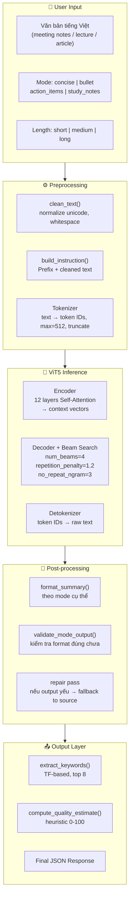
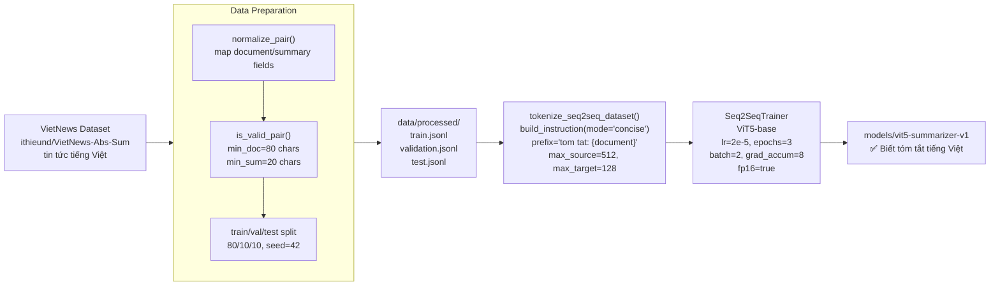
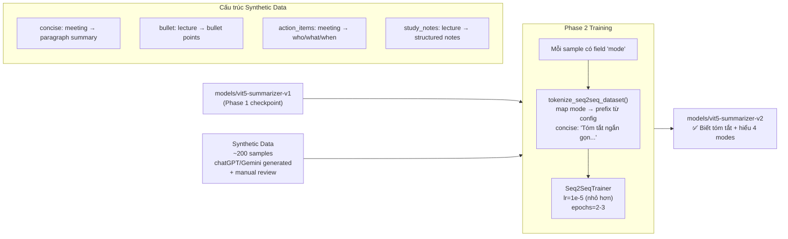
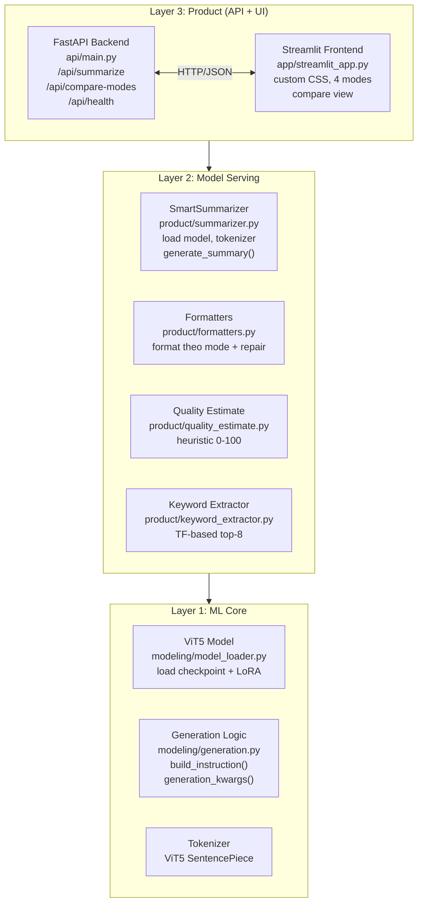

# Thuyết Trình Đồ Án: Smart Vietnamese Summarizer
## Phần 2 — Kỹ Thuật, Training Pipeline & Input-Process-Output

---

## 5. Toàn Bộ Pipeline: Input → Process → Output

### 5.1 Sơ Đồ Tổng Thể



---

### 5.2 Chi Tiết Từng Bước

#### Bước 1: Preprocessing

```python
# clean_text() — chuẩn hóa unicode NFC, collapse whitespace
# "Cuộc  họp  " → "Cuộc họp"

# build_instruction() — ghép prefix với text
MODE_PREFIXES = {
    "concise":      "Tóm tắt ngắn gọn thành một đoạn văn tự nhiên, không dùng bullet",
    "bullet":       "Tóm tắt thành các ý chính dạng bullet, mỗi bullet một ý",
    "action_items": "Chỉ trích xuất việc cần làm. Mỗi dòng gồm người phụ trách, hành động, deadline nếu có",
    "study_notes":  "Tạo ghi chú học tập. Nêu khái niệm chính, cần nhớ, ví dụ, lỗi dễ nhầm",
}

# Ví dụ output:
# "Tóm tắt ngắn gọn thành một đoạn văn tự nhiên, không dùng bullet: Cuộc họp hôm nay..."
```

**Tại sao max_source_length = 512?**
```
ViT5-base max position embedding: 512 tokens
512 tokens ≈ 300-400 từ tiếng Việt ≈ 1-2 trang A4

Tăng 1024 → VRAM tăng ~4× (attention O(n²)) → T4 OOM → LOẠI
Giảm 256  → mất quá nhiều info → tóm tắt kém     → LOẠI
512 = điểm cân bằng info vs GPU constraint
```

#### Bước 2: Generation với Beam Search

```python
generation_kwargs = {
    "max_new_tokens": 160,        # medium length
    "num_beams": 4,               # giữ 4 candidates song song
    "repetition_penalty": 1.2,    # giảm xác suất token đã xuất hiện
    "no_repeat_ngram_size": 3,    # cấm lặp 3-gram
    "length_penalty": 1.0,        # không ưu tiên dài hay ngắn
    "early_stopping": True,       # dừng khi beam tốt nhất gặp EOS
}
```

**Beam Search Visualization:**
```
Step 1:  Top 4 = ["Cuộc"(0.4), "Buổi"(0.35), "Bản"(0.15), "Nội"(0.10)]

Step 2:  Expand mỗi candidate:
         "Cuộc" → ["Cuộc họp"(0.72), "Cuộc thi"(0.18), ...]
         "Buổi" → ["Buổi họp"(0.68), "Buổi sáng"(0.20), ...]
         → Giữ top 4 global

...
Final:   Candidate có tổng log-prob cao nhất → output
```

#### Bước 3: Post-processing theo Mode

**Mode `concise`:**
```
Input raw:  "Tóm tắt ngắn gọn: Cuộc họp... Tóm tắt ngắn gọn: [lặp prefix]"
            ↓ remove_instruction_leakage()
            ↓ strip_mode_labels()
            ↓ split_sentences() → dedupe_preserve_order()
            ↓ limit đến N câu (short=1, medium=2, long=4)
Output:     "Cuộc họp quyết định tăng ngân sách Q3 và hoãn ra mắt sản phẩm."
```

**Mode `bullet`:**
```
Input raw:  "Quyết định tăng ngân sách. Hoãn ra mắt. Tăng ngân sách Q3."
            ↓ split_sentences()
            ↓ dedupe_near_preserve_order()  ← Jaccard similarity ≥ 0.72 → dedup
            ↓ format: "- " prefix
Output:     "- Quyết định tăng ngân sách Q3.\n- Hoãn ra mắt sản phẩm."
```

**Mode `action_items`:**
```
Input raw:  "An phụ trách rà soát dữ liệu trước thứ Tư."
            ↓ extract_owner() → "An"
            ↓ extract_action() → "rà soát dữ liệu"
            ↓ extract_deadline() → "trước thứ Tư"
Output:     "- Người phụ trách: An
               Hành động: rà soát dữ liệu
               Deadline: trước thứ Tư"
```

**Mode `study_notes`:**
```
Input raw:  "Khái niệm chính: Self-attention. Cần nhớ: mỗi token..."
            ↓ parse_labeled_lines()
            ↓ fallback to source_hints nếu thiếu label
            ↓ limit_words() theo length
Output:     "Khái niệm chính: Self-attention là cơ chế...
             Cần nhớ: Mỗi token tham chiếu đến mọi token khác
             Ví dụ: Câu 'cuộc họp quan trọng'
             Lỗi dễ nhầm: Attention không biết vị trí tuyệt đối"
```

#### Bước 4: Validate & Repair Pass

```python
def format_summary(text, source, mode, length):
    output = format_by_mode(text, source, mode, length)
    validation = validate_mode_output(output, mode)

    if validation["is_valid"]:
        return output   # ✅ Done

    # ❌ Output yếu → repair pass dùng source làm fallback
    if mode == "bullet":
        return format_bullet(f"{output}\n{source}", ...)
    if mode == "action_items":
        return format_action_items(f"{output}\n{source}", ...)
    # ...
```

**Tại sao cần repair pass?**
> Model đôi khi sinh output không đúng format (bullet chỉ có 1 item, study_notes thiếu label). Thay vì trả về output lỗi, hệ thống tự phục hồi bằng cách kết hợp với source text.

---

## 6. Training Pipeline Chi Tiết

### 6.1 Chiến Lược 2-Phase

**Lý do thiết kế 2 phases:**
```
Nếu train cả VietNews + Synthetic cùng lúc:
  VietNews: ~100,000 samples
  Synthetic: ~200 samples
  → Synthetic bị overwhelm, model không học được modes
  → KHÔNG HIỆU QUẢ

2-Phase solution:
  Phase 1: Học summarization core trên VietNews lớn
  Phase 2: Adapt nhẹ sang multi-mode trên synthetic nhỏ
  → Model học đúng thứ tự, không bị overwhelm
```

### 6.2 Phase 1: Summarization Core



**Hyperparameters Phase 1 — Giải thích:**

| Param | Giá trị | Reasoning |
|---|---|---|
| `learning_rate` | 2e-5 | Standard fine-tune LR. Cao hơn → catastrophic forgetting. Thấp hơn → gần như không học |
| `epochs` | 3 | Fine-tuning thường 2-5 epochs. Ít hơn → underfitting. Nhiều hơn → overfit |
| `batch_size` | 2 | T4 16GB chỉ fit 2 samples ViT5-base + gradients |
| `grad_accum` | 8 | Effective batch = 2×8 = 16, ổn định hơn batch=2 thuần |
| `fp16` | true | Giảm VRAM ~40%, tăng speed ~30%, T4 có Tensor Cores |
| `warmup_ratio` | 0.1 | 10% steps đầu tăng LR từ 0 → tránh spike ban đầu |
| `max_source` | 512 | Max capacity của ViT5-base |
| `max_target` | 128 | Summary thường ngắn, 128 tokens ≈ 80-100 từ |

---

### 6.3 Phase 2: Multi-Mode Adaptation



**Tại sao lr Phase 2 nhỏ hơn (1e-5 < 2e-5)?**
```
Phase 2 chỉ cần "nhắc nhở nhẹ" model về modes.
LR lớn hơn có thể phá knowledge đã học ở Phase 1
(catastrophic forgetting trên VietNews corpus).
→ lr=1e-5 đủ để adapt, không đủ để phá.
```

---

### 6.4 Loss Function & Optimization

**Cross-Entropy Loss:**
```
Model đang sinh token thứ t, dự đoán:
  P("tóm")  = 0.60
  P("và")   = 0.10
  P("cuộc") = 0.20
  P(...)    = 0.10

Target thực tế: "tóm"
Loss = -log(0.60) = 0.51

Nếu model tốt hơn: P("tóm") = 0.90 → Loss = 0.10 ✅
Nếu model sai:      P("tóm") = 0.05 → Loss = 3.00 ❌

Gradient descent giảm loss → model đoán đúng token hơn
```

**Gradient Accumulation — Giả lập batch lớn:**
```
GPU T4 chỉ chứa batch=2:

Bước 1: forward(batch_1) → loss → backward() [KHÔNG optimizer.step()]
Bước 2: forward(batch_2) → loss → backward() [KHÔNG optimizer.step()]
...
Bước 8: forward(batch_8) → loss → backward() → optimizer.step() ✅

Effective batch = 2 × 8 = 16
→ Gradient ổn định hơn, training smooth hơn
```

---

### 6.5 Controllable Generation: 3 Tầng Điều Khiển

```
TẦNG 1: PREFIX INSTRUCTION
  "Tóm tắt ngắn gọn..." → model thiên về concise output
  "Tóm tắt thành các ý chính dạng bullet..." → model thiên về bullet

TẦNG 2: GENERATION PARAMETERS
  Length "short"  → max_new_tokens=96
  Length "medium" → max_new_tokens=160
  Length "long"   → max_new_tokens=256

TẦNG 3: RULE-BASED POST-PROCESSING
  Bullet  → đảm bảo format "- item" (validate + repair)
  Action  → parse Owner/Action/Deadline
  Study   → enforce 4 labeled sections
```

> **Lưu ý học thuật:** Đây **KHÔNG phải** multi-task supervised training với dataset riêng cho mỗi task. Action items và study notes phụ thuộc vào khả năng generalize từ summarization sang extraction. Đây là limitation cần nêu rõ trong báo cáo.

---

## 7. Kiến Trúc Hệ Thống Hoàn Chỉnh

### 7.1 Layered Architecture



### 7.2 API Design

```
POST /api/summarize
Body: { "text": "...", "mode": "concise", "length": "medium" }
Response: {
    "summary": "...",
    "keywords": ["họp", "quyết định", ...],
    "quality_estimate": 78.5,
    "latency_ms": 2340,
    "input_tokens": 412,
    "output_tokens": 67,
    "mode": "concise",
    "length": "medium"
}

POST /api/compare-modes
Body: { "text": "...", "length": "medium" }
Response: { "results": { "concise": {...}, "bullet": {...}, ... } }

GET /api/health
Response: { "status": "ok", "model_loaded": true }
```

---

*→ Phần 3: Đánh giá mô hình, độ đo & Hạn chế / Định hướng*
