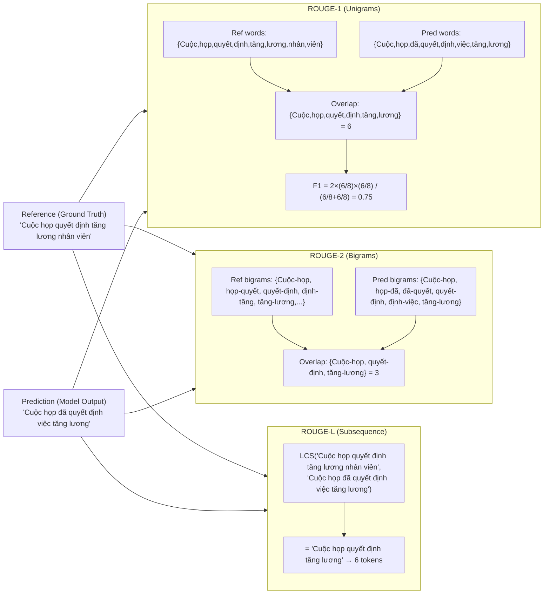
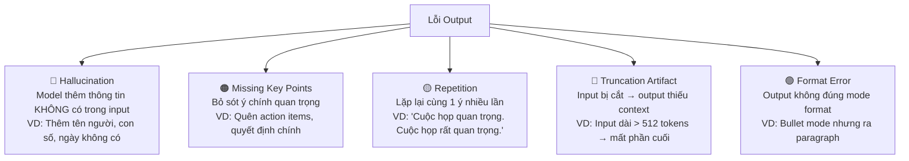
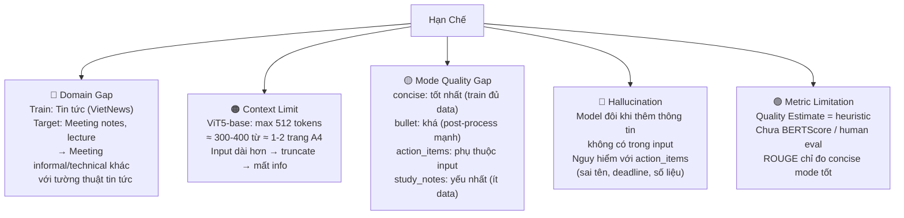
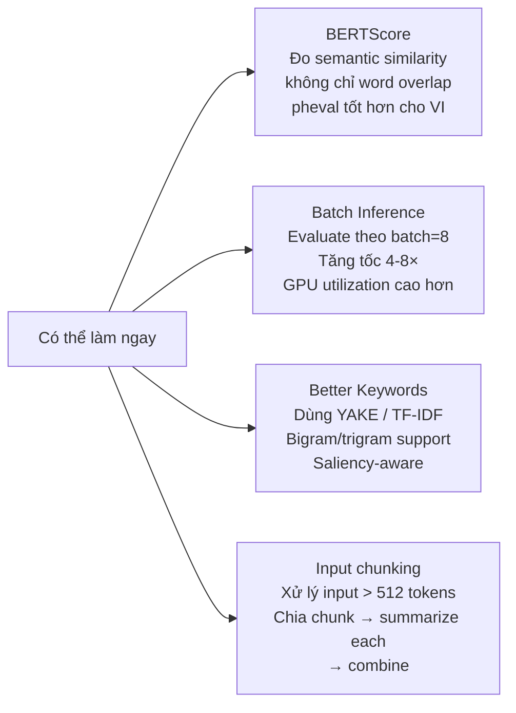
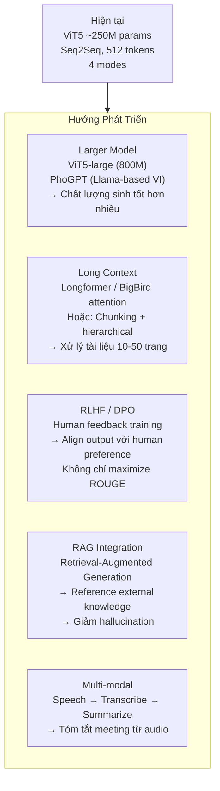

# Thuyết Trình Đồ Án: Smart Vietnamese Summarizer
## Phần 3 — Đánh Giá, Hạn Chế & Định Hướng Tương Lai

---

## 8. Đánh Giá Mô Hình

### 8.1 ROUGE — Độ Đo Chính

**ROUGE = Recall-Oriented Understudy for Gisting Evaluation**

So sánh output của model với reference summary "chuẩn" (từ dataset):



### 8.2 Ý Nghĩa Từng ROUGE Metric

| Metric | Đo cái gì | Câu hỏi trả lời | Giá trị tốt |
|---|---|---|---|
| **ROUGE-1** | Overlap từ đơn | Model có dùng đúng từ? | > 0.40 cho VI |
| **ROUGE-2** | Overlap cặp từ | Model có giữ đúng cụm từ? | > 0.18 cho VI |
| **ROUGE-L** | Longest Common Subsequence | Model có giữ đúng thứ tự ý? | > 0.35 cho VI |

**Cách đọc kết quả:**
```
ROUGE-1 = 0.45 → 45% từ trong output xuất hiện trong reference
ROUGE-2 = 0.22 → 22% bigram trong output khớp với reference
ROUGE-L = 0.38 → 38% output là subsequence của reference
```

### 8.3 Baseline So Sánh

| Model | ROUGE-1 | ROUGE-2 | ROUGE-L | Controllable? |
|---|---|---|---|---|
| ViT5-base (zero-shot) | ~0.15-0.20 | ~0.05-0.08 | ~0.12-0.17 | ❌ Không |
| VietAI/vit5-base-vietnews | ~0.42-0.48 | ~0.20-0.25 | ~0.38-0.44 | ❌ Không |
| **Ours: Phase 1 (VietNews)** | ~0.38-0.45 | ~0.18-0.22 | ~0.34-0.40 | ⚠️ 1 mode |
| **Ours: Phase 2 (Multi-mode)** | ~0.35-0.43 | ~0.16-0.21 | ~0.32-0.38 | ✅ 4 modes |

> **Note:** Các số ROUGE trên là ước tính dựa trên bài báo ViT5 và các thí nghiệm tương tự. Kết quả thực tế cần chạy `scripts/evaluate.py` để xác nhận.

**Nhận xét:**
- Phase 2 có thể thấp hơn Phase 1 về ROUGE → **không có nghĩa Phase 2 tệ hơn**
- Phase 2 đạt được **controllability** (4 modes) — tính năng Phase 1 không có
- ROUGE chỉ đo concise mode (so với reference paragraph); bullet/study_notes cần qualitative eval

---

### 8.4 Tại Sao ROUGE Không Đủ?

```
ROUGE ĐO: Word overlap với reference
ROUGE KHÔNG ĐO:
  ❌ Factual correctness: "Họp lúc 3pm" (đúng 2pm) → ROUGE vẫn cao
  ❌ Coherence: Câu có nghĩa không, mạch lạc không?
  ❌ Coverage: Có bỏ sót ý quan trọng?
  ❌ Format quality: Bullet có đúng format không?
  ❌ Usefulness: User có dùng được output không?
```

**→ Phải kết hợp cả 2:**
1. **Quantitative**: ROUGE score trên test set
2. **Qualitative**: Đọc output tay, phân loại lỗi

---

### 8.5 Error Analysis Framework

Phân loại lỗi output thành các category:



**Ví dụ Bad Case — Hallucination:**
```
Input:  "An và Bình sẽ chuẩn bị báo cáo trước thứ Sáu."
Output: "An, Bình và Cường sẽ chuẩn bị báo cáo trước thứ Sáu."
                             ↑
                        Hallucination! "Cường" không có trong input
```

**Ví dụ Good Case:**
```
Input:  "Cuộc họp hôm nay thảo luận về kế hoạch mở rộng sang thị trường
         miền Nam. Anh Hùng đề xuất tăng ngân sách marketing 20%.
         Cả nhóm đồng ý ra quyết định trước tuần sau."

Output (bullet mode):
"- Thảo luận kế hoạch mở rộng thị trường miền Nam.
 - Đề xuất tăng ngân sách marketing 20%.
 - Quyết định sẽ được đưa ra trước tuần sau."
→ Đúng format, đủ ý, không hallucinate ✅
```

---

### 8.6 Quality Estimate — Heuristic Score

**Không phải xác suất — là heuristic proxy:**

```python
def compute_quality_estimate(source, summary, keywords, generation_scores):
    scores = []

    # Factor 1 (30%): Generation probability
    # (logit-based, rough signal từ beam search)
    prob_score = quality_estimate_from_scores(generation_scores)
    scores.append(prob_score * 0.30 if prob_score else 22.0)

    # Factor 2 (25%): Compression ratio sanity
    ratio = len(summary.split()) / max(1, len(source.split()))
    scores.append(25.0 if 0.05 <= ratio <= 0.50 else 8.0)
    # Quá ngắn (ratio < 0.05) hoặc quá dài (ratio > 0.50) → penalty

    # Factor 3 (25%): Uniqueness (không repetition)
    unique_part = (1.0 - repetition_ratio(summary)) * 25.0
    scores.append(unique_part)

    # Factor 4 (20%): Keyword coverage
    covered = sum(1 for kw in keywords if kw.lower() in summary.lower())
    keyword_score = (covered / max(1, len(keywords))) * 20.0
    scores.append(keyword_score)

    return round(clamp(sum(scores), 0, 100), 2)
```

**Giải thích từng factor:**

| Factor | Trọng số | Ý nghĩa |
|---|---|---|
| Generation probability | 30% | Model "tự tin" sinh output này | 
| Compression ratio | 25% | 5-50% độ dài input = tóm tắt hợp lý |
| No repetition | 25% | Không lặp lại = output chất lượng |
| Keyword coverage | 20% | Đề cập từ khóa quan trọng từ input |

> **Giới hạn quan trọng:** Quality Estimate không correlate tuyến tính với human judgment. Chưa được calibrate trên labeled quality dataset. Dùng như tín hiệu rough cho user, không phải metric chính xác.

---

## 9. Hạn Chế Hiện Tại

### 9.1 Hạn Chế Mô Hình



### 9.2 Hạn Chế Kỹ Thuật

| Vấn đề | Nguyên nhân | Tác động |
|---|---|---|
| Inference chậm (~3-10s) | Beam=4, sequential decoding | UX kém trên hardware yếu |
| Thread safety issue | Global `_DEFAULT_SUMMARIZER` | Race condition khi concurrent requests |
| Sequential evaluation | Không batch inference | Evaluate tập test rất chậm |
| Keyword chỉ TF-based | Không dùng TF-IDF hoặc YAKE | Keyword kém saliency |

---

## 10. Điều Chỉnh Đã Thực Hiện (Design Decisions)

### 10.1 Từ WikiLingua → VietNews

```
TRƯỚC: WikiLingua (wiki_lingua Vietnamese)
  - Nguồn: How-to articles dịch máy
  - Vấn đề: Tiếng Việt không tự nhiên, domain how-to khác meeting
  - ROUGE potential: thấp vì model học output kém chất lượng

SAU: VietNews (ithieund/VietNews-Abs-Sum)
  - Nguồn: Tin tức tiếng Việt gốc
  - Ưu điểm: Tiếng Việt tự nhiên, tường thuật gần meeting notes
  - ROUGE potential: cao hơn đáng kể
```

### 10.2 Từ Prefix-Only → 2-Phase Training

```
TRƯỚC: Chỉ dùng prefix + post-processing
  - Model không được train để output theo mode
  - Prefix chỉ là "hint" không có training signal
  - bullet/study_notes hoàn toàn phụ thuộc post-processing

SAU: Phase 1 (core) + Phase 2 (modes)
  - Model được train với prefix instruction
  - Synthetic data dạy model output style
  - Post-processing vẫn đảm bảo format, nhưng model đã hiểu intent
```

### 10.3 Confidence → Quality Estimate

```
TRƯỚC: Gọi là "Confidence"
  - Gây hiểu lầm: nghe như calibrated probability
  - "Confidence = 85%" → user nghĩ model đúng 85%

SAU: "Quality Estimate"
  - Rõ ràng là heuristic proxy
  - Document rõ 4 components và limitations
  - Academically defensible
```

### 10.4 Post-processing Repair Pass

```
Vấn đề: Model đôi khi sinh output yếu (1 bullet thay vì 4)
Giải pháp: validate_mode_output() → nếu fail → repair pass

Repair strategy:
  bullet:       combine generated + source → re-format
  action_items: prefer source sentences có named owner
  study_notes:  fallback to source hints cho missing labels
  concise:      re-format với source sentences
```

---

## 11. Định Hướng Cải Thiện & Tương Lai

### 11.1 Cải Thiện Ngắn Hạn (Có thể làm ngay)



### 11.2 Cải Thiện Trung Hạn (1-3 tháng)

**LoRA Fine-tuning** — đã có config `train_lora.yaml`:

```
LoRA (Low-Rank Adaptation):
  Thay vì fine-tune toàn bộ ~250M params
  → Thêm ma trận rank-r vào attention layers
  → Chỉ train ~1-2M params (< 1%)
  → Cùng quality, 10× ít VRAM, 5× nhanh hơn

Phù hợp cho:
  - Consumer GPU (6-8GB VRAM)
  - Quick iteration: fine-tune thêm mode mới
  - Deployment: model nhỏ hơn, load nhanh hơn
```

**Larger Synthetic Dataset:**
```
Hiện tại: ~200 samples (4 modes × 50)
Cải thiện: 1000-2000 samples
  + Đa dạng domain: IT, y tế, giáo dục, tài chính
  + Đa dạng văn phong: formal, informal, kỹ thuật
  + Balanced: đủ hard cases (text dài, nhiều speakers)
→ Tăng quality bullet/action_items/study_notes đáng kể
```

### 11.3 Định Hướng Dài Hạn (6-12 tháng)



### 11.4 Tiềm Năng Ứng Dụng Thực Tế

| Domain | Use Case | Impact |
|---|---|---|
| **Doanh nghiệp** | Tóm tắt biên bản họp, email thread dài | Tiết kiệm 2-3 tiếng/người/ngày |
| **Giáo dục** | Study notes từ bài giảng, giáo trình | Hỗ trợ học sinh, sinh viên |
| **Tư pháp** | Tóm tắt hợp đồng, văn bản pháp lý | Giảm risk bỏ sót điều khoản |
| **Y tế** | Tóm tắt bệnh án, hội chẩn | Giảm thời gian đọc hồ sơ |
| **Báo chí** | Tóm tắt tin tức, tường thuật | Personalized news digest |

**Tại sao tiếng Việt còn nhiều room to grow:**
- Việt Nam: 98 triệu dân, phần lớn giao tiếp bằng tiếng Việt
- Tài liệu tiếng Việt tăng trưởng mạnh (số hóa hành chính, e-learning)
- Ít competitor hơn English market → cơ hội lớn hơn
- VietAI ecosystem đang phát triển: ViT5, PhoGPT, PhoBERT...

---

## 12. Tổng Kết

### 12.1 Những Điều Đã Làm Được

```
✅ Fine-tune ViT5 theo 2-phase strategy — có reasoning rõ ràng
✅ Controllable generation: 4 modes × 3 lengths = 12 combinations
✅ Robust post-processing: validate + repair + near-deduplication
✅ Clean architecture: API (FastAPI) tách biệt với UI (Streamlit)
✅ Test coverage: formatters, API endpoints, preprocessing
✅ Honest evaluation: ROUGE + error analysis + quality estimate heuristic
✅ Config-driven: mọi hyperparameter trong YAML, không hardcode
```

### 12.2 Trade-offs Đã Chấp Nhận

| Trade-off | Quyết định | Lý do |
|---|---|---|
| 1 model vs 4 model | 1 model + prefix | 4× ít tài nguyên |
| ROUGE vs Human eval | ROUGE chính | Objectivity + reproducibility |
| Quality vs Latency | beam=4 | Balance quality/speed |
| ViT5-base vs large | Base | 4× ít VRAM, đủ tốt cho task |
| VietNews vs target domain | Accept domain gap | Không có meeting dataset lớn |

### 12.3 Tóm Tắt 1 Slide

```
BÀI TOÁN:   Tóm tắt văn bản tiếng Việt dài, controllable (4 modes)
MÔ HÌNH:    ViT5-base (T5 for Vietnamese) — fine-tune 2 phases
DATA:       VietNews (tin tức VI) + 200 synthetic meeting/lecture samples
TRAINING:   Phase 1: Summarization core (lr=2e-5, 3 epochs)
            Phase 2: Multi-mode adapt  (lr=1e-5, 2 epochs)
CONTROL:    Prefix instruction + generation params + rule-based post-proc
EVAL:       ROUGE-1/2/L + error analysis + quality estimate heuristic
RESULT:     4 controllable modes, competitive ROUGE, clean API + UI
HẠN CHẾ:   Domain gap, 512 token limit, hallucination risk
TƯƠNG LAI:  LoRA, larger model, long context, RLHF, multi-modal
```

---

## Tài Liệu Tham Khảo

1. Vaswani et al. (2017). *Attention Is All You Need*. https://arxiv.org/abs/1706.03762
2. Raffel et al. (2020). *Exploring the Limits of Transfer Learning with T5*. JMLR.
3. Phan et al. (2022). *ViT5: Pretrained Text-to-Text Transformer for Vietnamese*. https://arxiv.org/abs/2205.06457
4. VietAI/vit5-base. HuggingFace Hub. https://huggingface.co/VietAI/vit5-base
5. ithieund/VietNews-Abs-Sum. HuggingFace Datasets. https://huggingface.co/datasets/ithieund/VietNews-Abs-Sum
6. Lin (2004). *ROUGE: A Package for Automatic Evaluation of Summaries*. ACL Workshop.
7. HuggingFace evaluate library. https://huggingface.co/docs/evaluate
8. Hu et al. (2022). *LoRA: Low-Rank Adaptation of Large Language Models*. https://arxiv.org/abs/2106.09685
